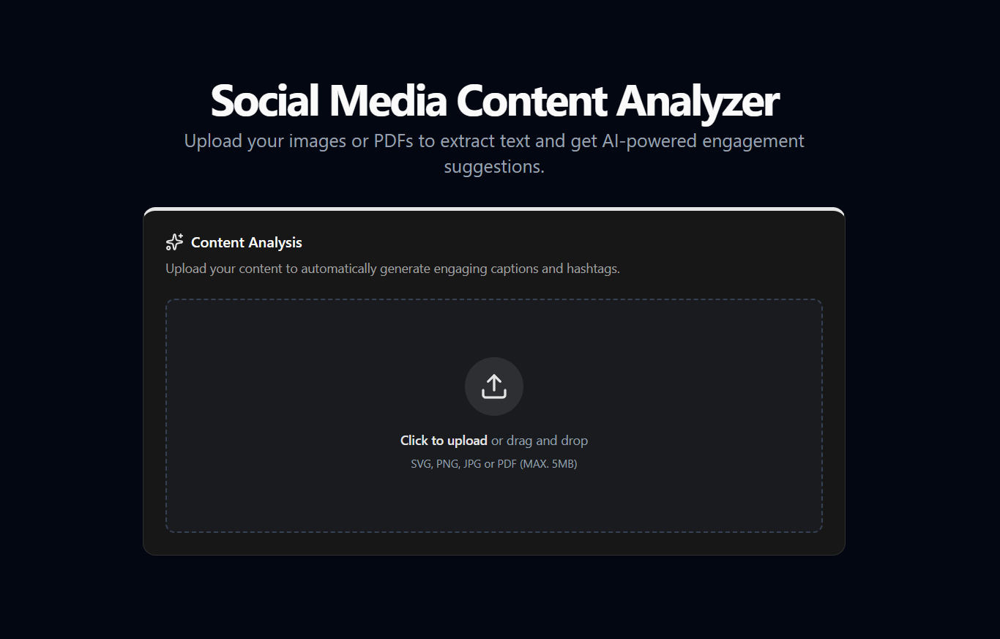

# 🛠️ Social Media Content Analyzer

**Social Media Content Analyzer** is a full-stack web application that extracts text from documents or images, analyzes social media content, classifies it, and provides actionable suggestions to improve engagement. It features a robust architecture with **Next.js (Frontend)** and **Node.js (Backend)**, leveraging AI for content analysis.

---

## 🔗 Live URL
- **Application:** [Social Media Content Analyzer](https://social-media-content-analyzer-ecru-delta.vercel.app/)

---

## 🚀 Key Features

### 📄 Document & Image Upload
- Upload PDF files or image files (e.g., scanned documents)
- Drag-and-drop or file picker interface
- Supports multiple file formats for easy input

### 📝 Text Extraction
- **PDF Parsing:** Extract text from PDFs while maintaining formatting
- **OCR (Optical Character Recognition):** Extract text from images using Tesseract.js

### 🤖 AI Content Analysis
- Classifies content type: `social_post`, `resume`, `quote`, `document`, `other`
- Generates **engagement score** (0–100) with reasoning
- Provides actionable **suggestions, hooks, CTAs, and hashtags** to boost engagement
- Returns structured JSON output for easy frontend integration

---

## 📸 Screenshots & Video
[_Video Walkthrough:_](https://drive.google.com/file/d/1S6tacrbX0Rc5PKEevjNA_37_ISDiKnVr/view?usp=sharing)

## 📸 Screenshots 

<!-- First row: Full-width Upload Page -->


<!-- Second row: Two Result Screenshots side by side -->
<table>
  <tr>
    <td></td>
    <td></td>
  </tr>
</table>


---

## 🧪 Tech Stack

| Layer           | Tech |
|-----------------|------|
| Frontend        | Next.js + TypeScript, Tailwind CSS, ShadCN UI |
| Backend         | Node.js, Express.js, Google Gemini API |
| Text Extraction | PDF Parsing (pdf-parse) |
| Image OCR       | Tesseract.js |
| Deployment      | Vercel (Frontend), Render (Backend) |

---

## 📁 Folder Structure

```plaintext
Social-Media-Content-Analyzer/
├── backend/                 
│   ├── routes/              # Express route handlers
│   │   └── upload.js        # File upload API
│   ├── utils/               # Helper functions
│   │   └── gemini.js        # AI analysis logic
│   └── index.js             # Express server entry point
├── frontend/                
│   ├── app/                 # Next.js 13+ app directory
│   │   ├── layout.tsx       # Main layout file
│   │   └── page.tsx         # Home page / main page
│   ├── components/          
│   │   ├── ui/              # Reusable UI components
│   │   └── SocialMediaAnalyzer/ # Core analyzer component
│   ├── styles/              # Tailwind CSS and global styles
│   └── utils/               # Frontend helper functions
├── package.json             # Root package.json for monorepo scripts
└── README.md                # Project overview, setup, and documentation

```

## 💻 Installation

Follow these steps to set up and run the Social Media Content Analyzer locally:

```bash
# Clone the repository
git clone https://github.com/RitikJain00/Social-Media-Content-Analyzer.git
cd Social-Media-Content-Analyzer

# -----------------------
# Backend Setup
# -----------------------
cd backend
npm install
# Create a .env file with required variables (API keys, PORT, etc.)
# Example:
# GEMINI_API_KEY=your_gemini_api_key
# PORT=5000
node index.js
# Backend will run at http://localhost:5000

# -----------------------
# Frontend Setup
# -----------------------
cd ../frontend
npm install
# Create a .env file if required (e.g., API base URL)
npm run dev
# Frontend will run at http://localhost:3000

```


## 🙌 Made With Love By Ritik Jain

  
🔗 [LinkedIn](https://www.linkedin.com/in/ritikjain00/) | ✉️ ritikjain590@gmail.com

